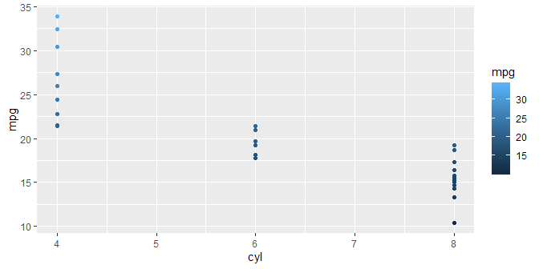
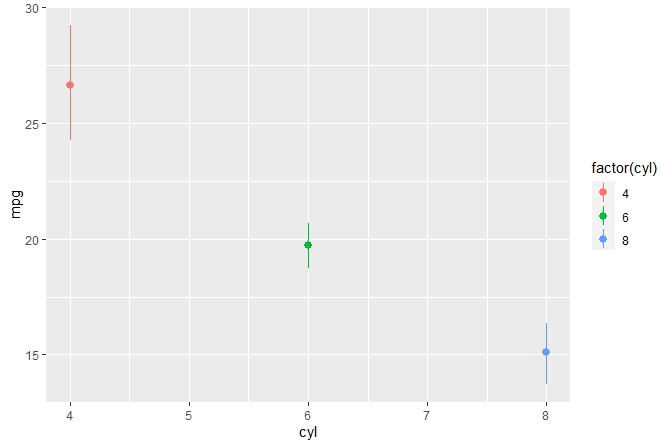
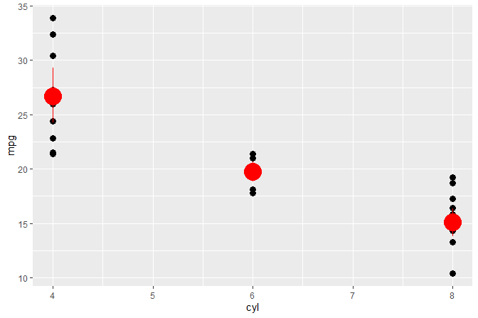
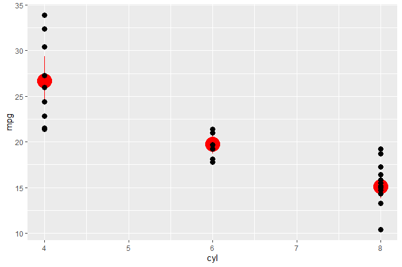

# gginnards 

[](https://cran.r-project.org/package=gginnards)
[](https://cran.r-project.org/web/checks/check_results_gginnards.html)
[](https://github.com/aphalo/gginnards/actions)

## Purpose

Package ‘gginnards’ (Explore the innards of ‘ggplot2’) is a set of
extensions to R package ‘ggplot2’ and tools specially useful when
learning how to write extensions and when debugging newly defined stats
and geoms.

Occasionally it may be useful to edit `gg` objects. A typical case are
packages that provide extensions to ‘ggplot2’ that construct and return
whole `gg` objects instead of new statistics and geometries. In such
cases in can be useful to programatically edit these `gg` objects.
Functions are provided for the manipulation of layers within
`gg`objects.

As the variables returned in `data` by many statistics depend on input,
some of these tools can be also useful in everyday plotting with
‘gplot2’ as a way of diagnosing problems.

## WARNING

Because of its nature, this package does not always play safe and nice
even if it tries to. No exported or internal function or object should
be imported or used in other packages, simply because they may change at
any time. Although I intend to maintain the package, I will not attempt
to actively keep it compatible with anything but the current version of
‘ggplot2’. Please, see the blog post [Playing on the same team as your
dependecy](https://www.tidyverse.org/blog/2022/09/playing-on-the-same-team-as-your-dependecy/)
by Thomas Lin Pedersen.

## History

This package was born when several functions were removed from package
‘ggpmisc’.

## Geometries

`geom_debug()` by default prints the `data` object received as input to
the console and generates no graphic output. As it takes as argument a
summary function, it allows great flexibility in how `data` is
displayed. `geom_debug()` is useful at any time when one needs to check
what variables are returned by statistics. Many statistics are well
documented and always return the same variables. For other statistics
even if well documented the returned variables in `data` vary depending
on grouping and/or the arguments passed to them, in which case this
geometry can also be useful when debugging scripts.

## Statistics

Statistics that echo their data input to the R console aim at easing
debugging during development of new geoms and statistics. They will also
help those learning how ggplot grouping, panels and layers work.

## Manipulation of layers

A set of functions easy the manipulation of layers in ggplot objects,
allowing deletion of any existing layer, insertion of new layers at any
position, and reordering of the existing layers.

## Manipulation of embedded data

A function to drop unused variables from the data object embedded in
`gg` and `ggplot` objects serves as an additional example of a
manipulation that may be useful when dealing with very large datasets.
Companion functions are defined to explore the embedded data.

## Examples

``` r
library(gginnards)
#> Loading required package: ggplot2
```

We print to the R console `data` as *seen* as input by geometries and
statistics.

``` r
ggplot(mtcars, aes(cyl, mpg, color = mpg)) +
  geom_point() +
  geom_debug()
```

<!-- -->

    #> [1] "Summary (head) of input 'data' to 'draw_panel()':"
    #>    colour x    y PANEL group
    #> 1 #30648F 6 21.0     1    -1
    #> 2 #30648F 6 21.0     1    -1
    #> 3 #356E9D 4 22.8     1    -1
    #> 4 #316692 6 21.4     1    -1
    #> 5 #29577E 8 18.7     1    -1
    #> 6 #275379 6 18.1     1    -1
    #> [1] "Summary (summary) of input 'params' to 'draw_panel()':"
    #>         Length Class     Mode       
    #> x       11     ViewScale environment
    #> x.sec   11     ViewScale environment
    #> x.range  2     -none-    numeric    
    #> y       11     ViewScale environment
    #> y.sec   11     ViewScale environment
    #> y.range  2     -none-    numeric    
    #> guides   4     Guides    environment

We print to the R console `colnames(data)`.

``` r
ggplot(mtcars, aes(cyl, mpg, color = mpg)) +
  geom_point() +
  geom_debug(summary.fun = colnames)
#> Warning in geom_debug(summary.fun = colnames): Ignoring unknown parameters:
#> `summary.fun`
```

<!-- -->

    #> [1] "Summary (head) of input 'data' to 'draw_panel()':"
    #>    colour x    y PANEL group
    #> 1 #30648F 6 21.0     1    -1
    #> 2 #30648F 6 21.0     1    -1
    #> 3 #356E9D 4 22.8     1    -1
    #> 4 #316692 6 21.4     1    -1
    #> 5 #29577E 8 18.7     1    -1
    #> 6 #275379 6 18.1     1    -1
    #> [1] "Summary (summary) of input 'params' to 'draw_panel()':"
    #>         Length Class     Mode       
    #> x       11     ViewScale environment
    #> x.sec   11     ViewScale environment
    #> x.range  2     -none-    numeric    
    #> y       11     ViewScale environment
    #> y.sec   11     ViewScale environment
    #> y.range  2     -none-    numeric    
    #> guides   4     Guides    environment

We print to the R console `data` as returned by `stat_summary()` and
*seen* as input by geometries.

``` r
ggplot(mtcars, aes(cyl, mpg, colour = factor(cyl))) +
  stat_summary(fun.data = "mean_cl_boot") +
  stat_summary(fun.data = "mean_cl_boot", geom = "debug")
```

<!-- -->

    #> [1] "Summary (head) of input 'data' to 'draw_panel()':"
    #>    colour x group        y     ymin     ymax PANEL flipped_aes orientation
    #> 1 #F8766D 4     1 26.66364 24.28114 29.33682     1       FALSE          NA
    #> 2 #00BA38 6     2 19.74286 18.77107 20.74286     1       FALSE          NA
    #> 3 #619CFF 8     3 15.10000 13.79232 16.40714     1       FALSE          NA
    #> [1] "Summary (summary) of input 'params' to 'draw_panel()':"
    #>         Length Class     Mode       
    #> x       11     ViewScale environment
    #> x.sec   11     ViewScale environment
    #> x.range  2     -none-    numeric    
    #> y       11     ViewScale environment
    #> y.sec   11     ViewScale environment
    #> y.range  2     -none-    numeric    
    #> guides   4     Guides    environment

We print to the R console `data` as *seen* as input by statistics that
use a *panel function*.

``` r
ggplot(mtcars, aes(cyl, mpg, colour = factor(cyl))) +
  stat_debug_panel()
```

<!-- -->

    #> [1] "Summary (head) of input 'data' to 'compute_panel()':"
    #>   x    y colour PANEL group
    #> 1 6 21.0      6     1     2
    #> 2 6 21.0      6     1     2
    #> 3 4 22.8      4     1     1
    #> 4 6 21.4      6     1     2
    #> 5 8 18.7      8     1     3
    #> 6 6 18.1      6     1     2

We build object `p` of class `gg` (a ggplot). We query the number of
layers and the position of layers by the class of the `ggproto` object.

``` r
p <-
  ggplot(mtcars, aes(cyl, mpg)) +
  geom_point(size = 3) +
  stat_summary(fun.data = "mean_cl_boot", color = "red", size = 2)

  num_layers(p)
#> [1] 2
  which_layers(p, "GeomPoint")
#> [1] 1
  which_layers(p, "StatSummary")
#> [1] 2

  p
```

<!-- -->

``` r
  move_layers(p, "GeomPoint", position = "top")
```

<!-- -->

## Installation

Installation of the most recent stable version from CRAN:

``` r
install.packages("gginnards")
```

Installation of the current unstable version from GitHub:

``` r
# install.packages("devtools")
devtools::install_github("aphalo/gginnards")
```

## Documentation

HTML documentation is available at
(<https://docs.r4photobiology.info/gginnards/>), including two
vignettes.

News about updates are regularly posted at
(<https://www.r4photobiology.info/>).

## Contributing

Please report bugs and request new features at
(<https://github.com/aphalo/gginnards/issues>). Pull requests are
welcome at (<https://github.com/aphalo/gginnards>).

## Citation

If you use this package to produce scientific or commercial
publications, please cite according to:

``` r
citation("gginnards")
#> To cite package 'gginnards' in publications use:
#> 
#>   Aphalo P (2023). _gginnards: Explore the Innards of 'ggplot2'
#>   Objects_. R package version 0.1.2,
#>   https://github.com/aphalo/gginnards,
#>   <https://www.r4photobiology.info>.
#> 
#> A BibTeX entry for LaTeX users is
#> 
#>   @Manual{,
#>     title = {gginnards: Explore the Innards of 'ggplot2' Objects},
#>     author = {Pedro J. Aphalo},
#>     year = {2023},
#>     note = {R package version 0.1.2, https://github.com/aphalo/gginnards},
#>     url = {https://www.r4photobiology.info},
#>   }
```

## License

© 2016-2023 Pedro J. Aphalo (<pedro.aphalo@helsinki.fi>). Released under
the GPL, version 2 or greater. This software carries no warranty of any
kind.
