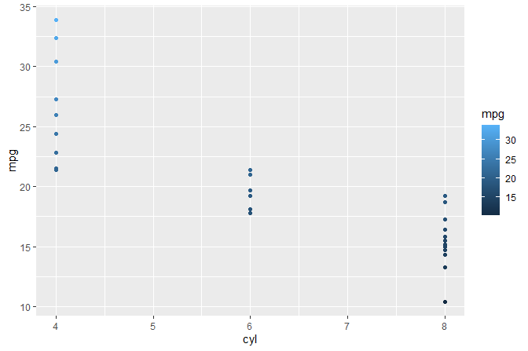
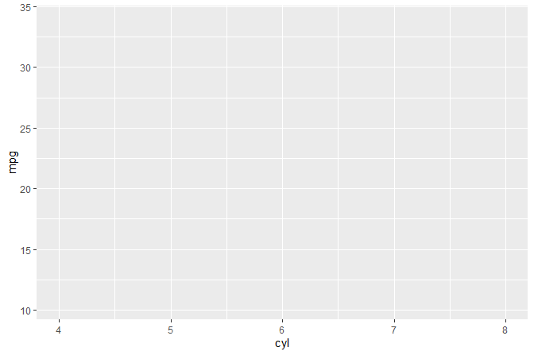

<!-- README.md is generated from README.Rmd. Please edit that file -->

# gginnards 

[](https://cran.r-project.org/package=gginnards)
[](https://github.com/aphalo/gginnards/actions)

## Purpose

Package ‘gginnards’ (Explore the innards of ‘ggplot2’) is a set of
extensions to R package ‘ggplot2’ and tools specially useful when
learning how to write extensions and when debugging newly defined stats
and geoms.

Occasionally it may be useful to edit `gg` objects. A typical case are
packages that provide extensions to ‘ggplot2’ that construct and return
whole `gg` objects instead of new statistics and geometries. In such
cases in can be useful to programmaticaly edit these `gg` objects.
Functions are provided for the manipulation of layers within
`gg`objects.

As the variables returned in `data` by many statistics depend on input,
some of these tools can be also useful in everyday plotting with
`ggplot2`.

## History

This package was born when several functions were removed from package
‘ggpmisc’.

## Geometries

`geom_debug()` by default prints the `data` object received as input to
the console and generates no graphic output. As it takes as arguments
functions, it allows great flexibility in how `data` is displayed or
saved. `geom_debug()` is useful at any time when one needs to check what
variables are returned by a statistics. Many statistics are well
documented and always return the same variables. For other statistics
even if well documented the returned variables in `data` vary depending
on grouping and/or the arguments passed to them, in which case this
geometry can also be useful when debugging scripts.

## Statistics

Statistics that echo their data input to the R console and/or plot aim
at easing debugging during development of new geoms and statistics. The
should help those learning how ggplot layers work.

## Manipulation of layers

A set of functions layestates the manipulation of layers in ggplot
objects, allowing deletion of any existing layer, insertion of new
layers at any position, and reordering of the existing layers.

## Manipulation of embedded data

A function to drop unused variables from the data object embedded in
`gg` and `ggplot` objects serves as an additional example of a
manipulation that may be useful when dealing with very large datasets.
Companion functions are defined to explore the embedded data.

## Examples

``` r
library(gginnards)
#> Loading required package: ggplot2
```

We print to the R console `data` as *seen* as input by geometries and
statistics.

``` r
ggplot(mtcars, aes(cyl, mpg, color = mpg)) +
  geom_point() +
  geom_debug()
```

<!-- -->

    #> # A tibble: 32 x 5
    #>    colour      x     y PANEL group
    #>    <chr>   <dbl> <dbl> <fct> <int>
    #>  1 #30648F     6  21   1        -1
    #>  2 #30648F     6  21   1        -1
    #>  3 #356E9D     4  22.8 1        -1
    #>  4 #316692     6  21.4 1        -1
    #>  5 #29577E     8  18.7 1        -1
    #>  6 #275379     6  18.1 1        -1
    #>  7 #1D3F5E     8  14.3 1        -1
    #>  8 #3977A9     4  24.4 1        -1
    #>  9 #356E9D     4  22.8 1        -1
    #> 10 #2A5982     6  19.2 1        -1
    #> # ... with 22 more rows

We print to the R console `colnames(data)`.

``` r
ggplot(mtcars, aes(cyl, mpg, color = mpg)) +
  geom_point() +
  geom_debug(summary.fun = colnames)
```

<!-- -->

    #> [1] "colour" "x"      "y"      "PANEL"  "group"

We print to the R console `data` as returned by `stat_summary()` and
*seen* as input by geometries.

``` r
ggplot(mtcars, aes(cyl, mpg, colour = factor(cyl))) +
  stat_summary(fun.data = "mean_cl_boot") +
  stat_summary(fun.data = "mean_cl_boot", geom = "debug")
```

<!-- -->

    #> # A tibble: 3 x 8
    #>   colour      x group     y  ymin  ymax PANEL flipped_aes
    #>   <chr>   <dbl> <int> <dbl> <dbl> <dbl> <fct> <lgl>      
    #> 1 #F8766D     4     1  26.7  24.2  29.1 1     FALSE      
    #> 2 #00BA38     6     2  19.7  18.8  20.7 1     FALSE      
    #> 3 #619CFF     8     3  15.1  13.8  16.3 1     FALSE

We print to the R console `data` as *seen* as input by statistics that
use a *panel function*.

``` r
ggplot(mtcars, aes(cyl, mpg, colour = factor(cyl))) +
  stat_summary(fun.data = "mean_cl_boot") +
  stat_debug_panel()
```

<!-- -->

    #> [1] "Input 'data' to 'compute_panel()':"
    #> # A tibble: 32 x 5
    #>        x     y colour PANEL group
    #>    <dbl> <dbl> <fct>  <fct> <int>
    #>  1     6  21   6      1         2
    #>  2     6  21   6      1         2
    #>  3     4  22.8 4      1         1
    #>  4     6  21.4 6      1         2
    #>  5     8  18.7 8      1         3
    #>  6     6  18.1 6      1         2
    #>  7     8  14.3 8      1         3
    #>  8     4  24.4 4      1         1
    #>  9     4  22.8 4      1         1
    #> 10     6  19.2 6      1         2
    #> # ... with 22 more rows

We build object `p` of class `gg` (a ggplot). We query the number of
layers and the position of layers by the class of the `ggproto` object.

``` r
p <-
  ggplot(mtcars, aes(cyl, mpg)) +
  geom_point(size = 3) +
  stat_summary(fun.data = "mean_cl_boot", color = "red", size = 2)

  num_layers(p)
#> [1] 2
  which_layers(p, "GeomPoint")
#> [1] 1
  which_layers(p, "StatSummary")
#> [1] 2

  p
```

<!-- -->

``` r
  move_layers(p, "GeomPoint", position = "top")
```

<!-- -->

## Installation

Installation of the most recent stable version from CRAN:

``` r
install.packages("gginnards")
```

Installation of the current unstable version from GitHub:

``` r
# install.packages("devtools")
devtools::install_github("aphalo/gginnards")
```

## Documentation

HTML documentation is available at
(<https://docs.r4photobiology.info/gginnards/>), including two
vignettes.

News about updates are regularly posted at
(<https://www.r4photobiology.info/>).

## Contributing

Please report bugs and request new features at
(<https://github.com/aphalo/gginnards/issues>). Pull requests are
welcome at (<https://github.com/aphalo/gginnards>).

## Citation

If you use this package to produce scientific or commercial
publications, please cite according to:

``` r
citation("gginnards")
#> 
#> To cite package 'gginnards' in publications use:
#> 
#>   Pedro J. Aphalo (2021). gginnards: Explore the Innards of 'ggplot2'
#>   Objects. https://www.r4photobiology.info,
#>   https://github.com/aphalo/gginnards.
#> 
#> A BibTeX entry for LaTeX users is
#> 
#>   @Manual{,
#>     title = {gginnards: Explore the Innards of 'ggplot2' Objects},
#>     author = {Pedro J. Aphalo},
#>     year = {2021},
#>     note = {https://www.r4photobiology.info, https://github.com/aphalo/gginnards},
#>   }
```

## License

© 2016-2021 Pedro J. Aphalo (<pedro.aphalo@helsinki.fi>). Released under
the GPL, version 2 or greater. This software carries no warranty of any
kind.
